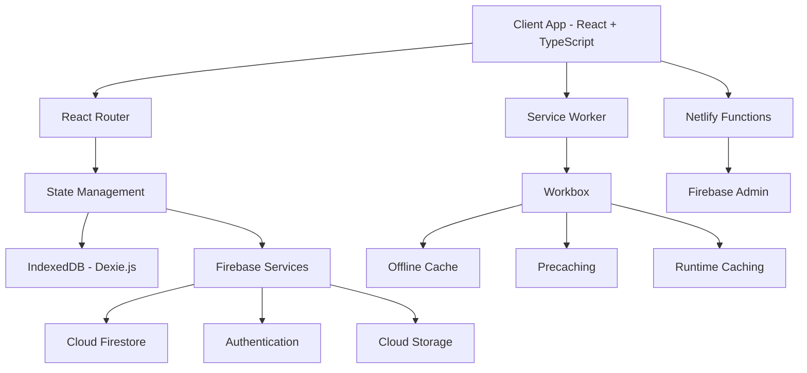
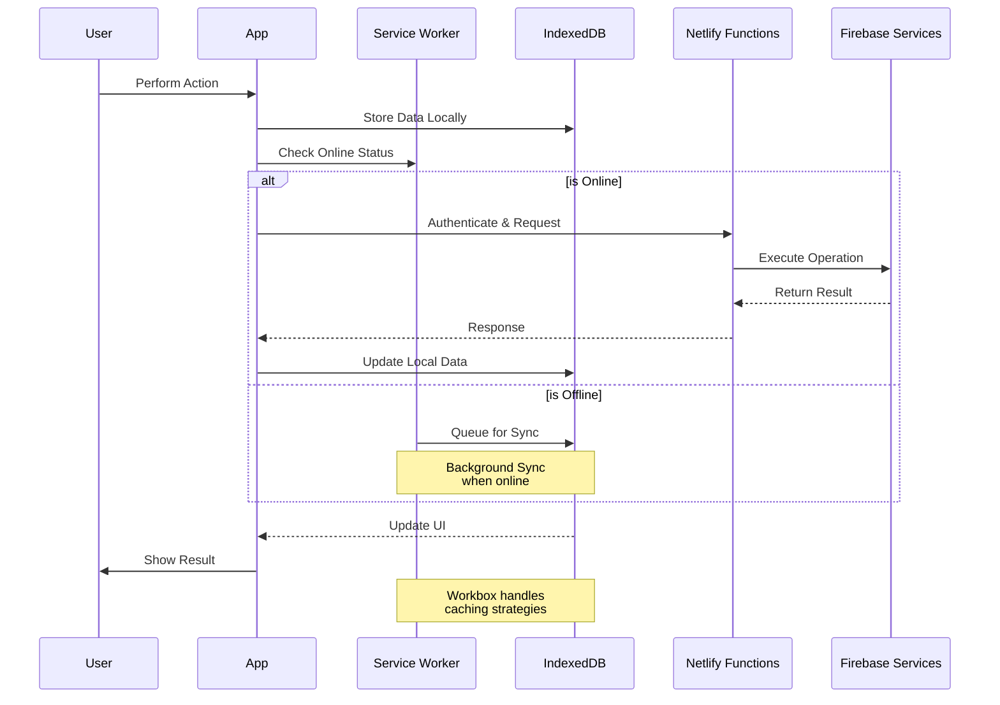

# Personal Finance PWA

[](https://app.netlify.com/)

## Vision
To empower individuals with tools and insights that improve their financial health and well-being.

## Technology Stack
- **Frontend**: React 19 with TypeScript
- **Framework**: Vite 7
- **Styling**: Bootstrap 5, Sass, React Bootstrap
- **PWA**: Vite PWA Plugin
- **Data Storage**: Dexie.js (IndexedDB)
- **Routing**: React Router 7
- **Charts**: Recharts
- **Icons**: React Icons
- **Deployment**: Netlify
- **Code Quality**: ESLint, TypeScript

## Getting Started

### Prerequisites
- Node.js (Latest LTS version)
- npm or yarn
- Git

### Installation
```bash
# Clone the repository
git clone https://github.com/Swapnil-PixArtPrinting/Personal-Finance-PWA.git

# Navigate to project directory
cd Personal-Finance-PWA

# Install dependencies
npm install
```

### Development Commands
```bash
# Start development server
npm run dev

# Start Netlify dev server (with Netlify Functions)
npm run dev:netlify

# Build for production
npm run build

# Preview production build
npm run serve

# Lint code
npm run lint

# Serve Netlify functions locally
npm run functions:serve
```

## Purpose
The Personal Finance PWA is designed to provide a complete financial management solution that helps users:
- Track and manage various types of investments and assets
- Monitor and control monthly expenses and cash flow
- Plan and track progress towards financial goals
- Analyze investment portfolio and withdrawal strategies
- Manage family finances with multi-user support
- Access financial data securely from any device

## Core Features

### Financial Management
- 💰 Comprehensive income and expense tracking
- 📈 Investment portfolio management
- � Liability and loan tracking
- 🎯 Goal-based financial planning
- 📊 SWP (Systematic Withdrawal Plan) analysis
- 👥 Family member account management

### Asset Management
- 📈 Multiple asset classes (Equity, Debt, Liquid, Commodity, Real Estate)
- � Various investment types (Mutual Funds, Stocks, ULIP, FDs, etc.)
- 🏦 Bank account management
- 💸 SIP (Systematic Investment Plan) tracking
- 📅 Short-term and long-term investment buckets

### Planning & Analysis
- 🎯 Goal tracking with priority management
- 🏥 Emergency fund planning
- 🏦 Retirement planning
- � Education planning
- 💒 Marriage planning
- 📈 Investment performance analysis

### Technical Features
- 📱 Progressive Web App (PWA) with offline support
- 🔄 Cross-device data synchronization
- 💾 Local data persistence with IndexedDB
- 🔒 Secure authentication and restricted access
- 📊 Rich data visualization
- 📱 Responsive design for all devices

### 🔒 Security
- Firebase Authentication for secure user management
- Data encryption in transit and at rest
- Secure offline data storage with IndexedDB
- Environment variable protection

## 🏗️ Architecture



## 🔄 Data Flow



## Project Structure
```
├── public/                 # Static files
│   ├── android/           # Android PWA icons
│   ├── ios/              # iOS PWA icons
│   ├── windows11/        # Windows PWA icons
│   ├── manifest.json     # PWA manifest
│   └── offline.html      # Offline fallback page
├── netlify/
│   └── functions/        # Netlify serverless functions
├── src/
│   ├── components/       # React components
│   ├── hooks/           # Custom React hooks
│   ├── pages/           # Page components
│   ├── services/        # API and service layer
│   ├── styles/          # Global styles and themes
│   ├── types/           # TypeScript types/interfaces
│   ├── utils/           # Utility functions
│   ├── App.tsx          # Root component
│   └── main.tsx         # Entry point
├── vite.config.ts        # Vite configuration
├── tsconfig.json         # TypeScript configuration
├── package.json          # Dependencies and scripts
└── README.md            # Project documentation
```

## Contributing
1. Fork the repository
2. Create your feature branch (`git checkout -b feature/AmazingFeature`)
3. Commit your changes (`git commit -m 'Add some AmazingFeature'`)
4. Push to the branch (`git push origin feature/AmazingFeature`)
5. Open a Pull Request

## License
This project is licensed under the MIT License - see the LICENSE file for details.

## 🚀 Quick Start

1. **Clone the repository**
   ```bash
   git clone https://github.com/swapnil-bhamat/Personal-Finance-PWA.git
   cd Personal-Finance-PWA
   ```

2. **Install dependencies**
   ```bash
   npm install
   ```

3. **Set up environment variables**
   Create a `.env` file in the root directory and add your environment variables:
   ```env
   VITE_FIREBASE_API_KEY=your_api_key
   VITE_FIREBASE_AUTH_DOMAIN=your_auth_domain
   VITE_FIREBASE_PROJECT_ID=your_project_id
   VITE_FIREBASE_STORAGE_BUCKET=your_storage_bucket
   VITE_FIREBASE_MESSAGING_SENDER_ID=your_messaging_sender_id
   VITE_FIREBASE_APP_ID=your_app_id
   ```

4. **Start development server**
   ```bash
   npm run dev
   ```

5. **Build for production**
   ```bash
   npm run build
   ```

## 🔥 Firebase Setup

1. **Create a Firebase Project**
   - Go to [Firebase Console](https://console.firebase.google.com/)
   - Click on "Add Project"
   - Follow the setup wizard to create your project

2. **Enable Authentication**
   - In Firebase Console, go to "Authentication"
   - Click "Get Started"
   - Enable the authentication methods you want to use (Email/Password, Google, etc.)

3. **Set up Cloud Firestore**
   - Go to "Firestore Database"
   - Click "Create Database"
   - Choose your security rules and region
   - Start in production mode

4. **Configure Security Rules**
   - In Firestore, go to "Rules" tab
   - Update the security rules:
   ```javascript
   rules_version = '2';
   service cloud.firestore {
     match /databases/{database}/documents {
       match /{document=**} {
         allow read, write: if request.auth != null;
       }
     }
   }
   ```

5. **Get Firebase Configuration**
   - Go to Project Settings (gear icon)
   - Under "General" tab, scroll to "Your apps"
   - Click on the web icon (</>)
   - Register your app and copy the configuration
   - Add the configuration to your environment variables

## 📦 Technology Stack

- **Frontend Framework**: React 19.1
- **Language**: TypeScript 5.8
- **Build Tool**: Vite 4.7
- **Database**: 
  - Cloud: Firebase
  - Local: IndexedDB (Dexie.js)
- **Styling**: Bootstrap 5.3, SASS
- **PWA**: Workbox, Vite PWA Plugin
- **Charts**: Recharts
- **Routing**: React Router DOM
- **Form Validation**: Zod
- **Icons**: Lucide React, React Icons
- **Deployment**: Netlify

## 📁 Project Structure

```
src/
├── components/     # Reusable UI components
├── hooks/         # Custom React hooks
├── pages/         # Application pages/routes
├── services/      # API and service integrations
├── styles/        # Global styles and themes
└── utils/         # Helper functions and utilities
```

## 📝 Scripts

- `npm run dev` - Start development server
- `npm run dev:netlify` - Start Netlify dev server
- `npm run build` - Build for production
- `npm run serve` - Preview production build
- `npm run lint` - Run ESLint
- `npm run functions:serve` - Serve Netlify functions locally

## 🤝 Contributing

1. Fork the repository
2. Create your feature branch (`git checkout -b feature/AmazingFeature`)
3. Commit your changes (`git commit -m 'Add some AmazingFeature'`)
4. Push to the branch (`git push origin feature/AmazingFeature`)
5. Open a Pull Request

## 📄 License
This project is licensed under the MIT License - see the LICENSE file for details.

## References
 - https://investyadnya.in/
 - https://www.youtube.com/@InvestYadnya

## 👨‍💻 Author
Swapnil Bhamat
