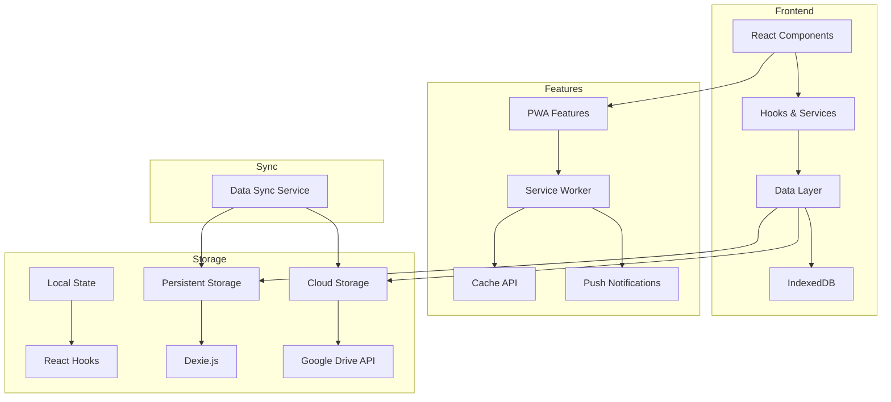

# Personal Finance PWA

A Progressive Web Application for personal finance management, built with React, TypeScript, and modern web technologies.

## 🌟 Features

- 📱 Progressive Web App (PWA) with offline support
- 💰 Track income and expenses
- 📊 Visual analytics and reports
- ☁️ Cloud backup with Google Drive integration
- 🔄 Data synchronization
- 📱 Responsive design for all devices
- 🔒 Local data storage using IndexedDB (Dexie.js)
- 📈 Interactive charts with Recharts

## ✅ TODO

- ~~Add light/dark toggle.~~
- Add pie chart to show projected assets growth in a year in dashboard.
- Add page to do trial assets allocation see the changes in projected assets growth via pie chart.
- Add calculators like Retirement, Child Education, Child Marriage etc.
- Add Zod layer before DB entry to ensure valid data entry.
- Add icons for the Need, Want, and savings. Also, add icons for the asset type and subtype.
- Add UI for the push notification to update data.

## 🏗️ Architecture



## 🚀 Tech Stack

- **Frontend Framework:** React 19 with TypeScript
- **Build Tool:** Vite 7
- **Styling:** SASS, Bootstrap 5, React Bootstrap
- **Data Storage:** Dexie.js (IndexedDB wrapper)
- **PWA Support:** Vite PWA Plugin
- **Routing:** React Router DOM
- **Charts:** Recharts
- **Icons:** React Icons
- **Documentation:** React Markdown with GFM

## 📥 Installation

1. Clone the repository:

```bash
git clone https://github.com/swapnil-bhamat/Personal-Finance-PWA.git
cd Personal-Finance-PWA
```

2. Install dependencies:

```bash
npm install
```

3. Start the development server:

```bash
npm run dev
```

## 🛠️ Available Scripts

- \`npm run dev\` - Start development server
- \`npm run dev:netlify\` - Start Netlify development environment
- \`npm run build\` - Build for production
- \`npm run serve\` - Preview production build
- \`npm run lint\` - Lint source files
- \`npm run functions:serve\` - Serve Netlify functions locally

## 📱 PWA Features

- Offline support
- Installable on all devices
- Push notifications (coming soon)
- Background sync
- Responsive design
- App-like experience

## 🎨 Design System

The application uses Bootstrap 5 with React Bootstrap components for a consistent and responsive design system. Custom SASS styling extends the base theme for a unique visual identity.

## 🔒 Security

- Local data storage using IndexedDB
- Encrypted data synchronization with Google Drive
- OAuth 2.0 authentication for cloud storage
- No sensitive data transmission
- Secure by design architecture

## 🤝 Contributing

1. Fork the repository
2. Create your feature branch (\`git checkout -b feature/AmazingFeature\`)
3. Commit your changes (\`git commit -m 'Add some AmazingFeature'\`)
4. Push to the branch (\`git push origin feature/AmazingFeature\`)
5. Open a Pull Request

## 📄 License

This project is licensed under the MIT License - see the LICENSE file for details.

## 📞 Support

For support, please open an issue in the GitHub repository.
