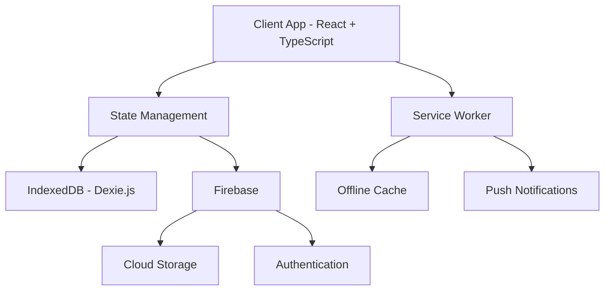
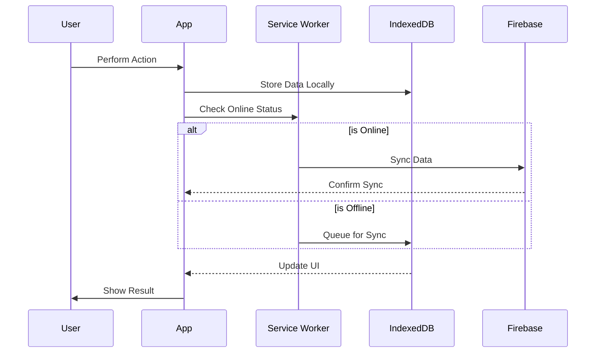

# Personal Finance PWA

A comprehensive Progressive Web Application for managing personal finances with offline capabilities, built with React, TypeScript, and Vite. This application helps users track investments, monitor expenses, plan financial goals, and analyze their financial health with robust offline support and cross-device synchronization.

## Purpose

The Personal Finance PWA is designed to provide a complete financial management solution that helps users:
- Track and manage various types of investments and assets
- Monitor and control monthly expenses and cash flow
- Plan and track progress towards financial goals
- Analyze investment portfolio and withdrawal strategies
- Manage family finances with multi-user support
- Access financial data securely from any device

## Core Features

### Financial Management
- 💰 Comprehensive income and expense tracking
- 📈 Investment portfolio management
- � Liability and loan tracking
- 🎯 Goal-based financial planning
- 📊 SWP (Systematic Withdrawal Plan) analysis
- 👥 Family member account management

### Asset Management
- 📈 Multiple asset classes (Equity, Debt, Liquid, Commodity, Real Estate)
- � Various investment types (Mutual Funds, Stocks, ULIP, FDs, etc.)
- 🏦 Bank account management
- 💸 SIP (Systematic Investment Plan) tracking
- 📅 Short-term and long-term investment buckets

### Planning & Analysis
- 🎯 Goal tracking with priority management
- 🏥 Emergency fund planning
- 🏦 Retirement planning
- � Education planning
- 💒 Marriage planning
- 📈 Investment performance analysis

### Technical Features
- 📱 Progressive Web App (PWA) with offline support
- 🔄 Cross-device data synchronization
- 💾 Local data persistence with IndexedDB
- 🔒 Secure authentication and restricted access
- 📊 Rich data visualization
- 📱 Responsive design for all devices

## 🏗️ Architecture



## 🔄 Data Flow



## 🚀 Quick Start

1. **Clone the repository**
   ```bash
   git clone https://github.com/swapnil-bhamat/Personal-Finance-PWA.git
   cd Personal-Finance-PWA
   ```

2. **Install dependencies**
   ```bash
   npm install
   ```

3. **Set up environment variables**
   Create a `.env` file in the root directory with your Firebase configuration:
   ```env
   VITE_FIREBASE_API_KEY=your_api_key
   VITE_FIREBASE_AUTH_DOMAIN=your_auth_domain
   VITE_FIREBASE_PROJECT_ID=your_project_id
   VITE_FIREBASE_STORAGE_BUCKET=your_storage_bucket
   VITE_FIREBASE_MESSAGING_SENDER_ID=your_sender_id
   VITE_FIREBASE_APP_ID=your_app_id
   ```

4. **Run development server**
   ```bash
   npm run dev
   ```

5. **Build for production**
   ```bash
   npm run build
   ```

## 📦 Tech Stack

- **Frontend Framework**: React 19
- **Language**: TypeScript
- **Build Tool**: Vite
- **UI Framework**: Bootstrap 5
- **Database**: IndexedDB (Dexie.js)
- **Backend/Auth**: Firebase
- **PWA**: Workbox
- **Deployment**: Netlify
- **Charts**: Recharts
- **Routing**: React Router DOM
- **Form Validation**: Zod

## 📁 Project Structure

```
src/
├── components/     # Reusable UI components
├── hooks/         # Custom React hooks
├── pages/         # Application pages/routes
├── services/      # API and service integrations
├── styles/        # Global styles and themes
└── utils/         # Helper functions and utilities
```

## 🔒 Security

- Firebase Authentication for secure user management
- Data encryption in transit and at rest
- Secure offline data storage with IndexedDB
- Environment variable protection

## 🌐 PWA Features

- Offline functionality
- App-like experience
- Push notifications
- Background sync
- Automatic updates
- Cross-platform support

## 📝 Scripts

- `npm run dev` - Start development server
- `npm run dev:netlify` - Start Netlify dev server
- `npm run build` - Build for production
- `npm run serve` - Preview production build
- `npm run lint` - Run ESLint
- `npm run functions:serve` - Serve Netlify functions locally

## 🤝 Contributing

1. Fork the repository
2. Create your feature branch (`git checkout -b feature/AmazingFeature`)
3. Commit your changes (`git commit -m 'Add some AmazingFeature'`)
4. Push to the branch (`git push origin feature/AmazingFeature`)
5. Open a Pull Request

## 📄 License

This project is licensed under the MIT License - see the LICENSE file for details.

## 👨‍💻 Author

Swapnil Bhamat
```
