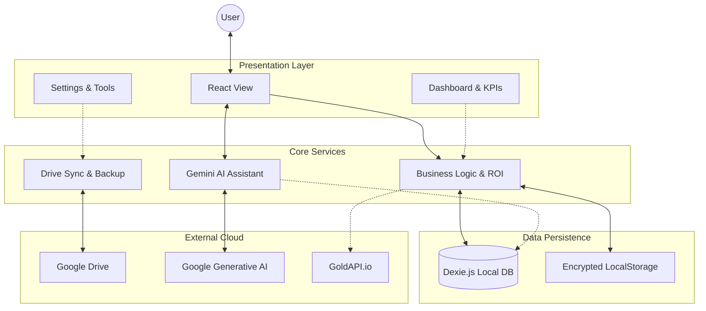

# Personal Finance PWA

A Progressive Web Application for personal finance management, built with React, TypeScript, and modern web technologies.

## 🌟 Features

- 📱 **Progressive Web App (PWA)**: Installable on all devices with offline support.
- 💰 **Financial Tracking**: Track income, expenses, assets, and liabilities.
- 🔄 **Undo/Redo System**: Full session-based undo/redo history to prevent accidental data loss.
- ☁️ **Smart Cloud Backups**:
  - Integrated into Settings for easy management.
  - **Versioned Backups**: Restore from any previous point in time.
  - **Smart Change Detection**: Prevents redundant backups if data hasn't changed.
- 🤖 **AI Assistant**: Built-in chatbot powered by Google Gemini to analyze your finances.
  - **Natural Language Queries**: Ask questions about your net worth, spending, etc.
  - **Image Rendering**: View AI-generated images directly in the chat.
  - **Dynamic Model Selection**: Auto-fetches available models based on your API Key.
  - **Secure Configuration**: Bring your own API Key. Keys are encrypted and stored locally.
  - **Read-Only Mode**: AI has read access to give insights but cannot modify your data for safety.
- 🎯 **Financial Freedom Tracker**:
  - **FI Number Calculation**: Automatically calculates your target corpus using the 3.5% rule (34.3x annual expenses).
  - **Visual Progression**: Track your journey through financial independence stages with an interactive KPI.
- 🧪 **Labs**: Experimental tools and calculators.
  - **REITs Simulator**: Simulate Real Estate Investment Trust returns.
  - **Commodity Rates**: Live Gold (10g) and Silver (1kg) rates (powered by GoldAPI, cached daily).
- 📊 **Analytics**: Visual analytics and reports using Recharts.
- 🔒 **Security**: Biometric app lock and local data encryption.
- 🔄 **Real-time Sync**: Seamless data synchronization across devices.
- 📱 **Responsive Design**: Optimized for mobile, tablet, and desktop.
- 📈 **Projections**: Advanced financial projection tools (Retirement, Net Worth).

## 🏗️ Architecture



## 📂 Project Structure

```
src/
├── components/     # Reusable UI components
├── hooks/          # Custom React hooks
├── pages/          # Application pages and routes
├── services/       # Business logic, DB, and API services
├── styles/         # Global styles and themes
├── types/          # TypeScript type definitions
└── utils/          # Helper functions and utilities
```

## 🚀 Tech Stack

- **Frontend:** React 19, TypeScript
- **AI:** Google Gemini API (Flash/Pro models)
- **Build Tool:** Vite 7
- **Styling:** Bootstrap 5, React Bootstrap, SASS
- **State Management:** React Context + Hooks
- **Database:** Dexie.js (IndexedDB wrapper)
- **Charts:** Recharts
- **Routing:** React Router DOM
- **PWA:** Vite PWA Plugin
- **Icons:** React Icons

## 📥 Installation

1. Clone the repository:

```bash
git clone https://github.com/swapnil-bhamat/Personal-Finance-PWA.git
cd Personal-Finance-PWA
```

2. **Configure Environment Variables:**

   Create a `.env` file from the example and update it with your credentials:

   ```bash
   cp .env.example .env
   ```

   Open `.env` and fill in your details (Google Client ID, etc.).

3. Install dependencies:

```bash
npm install
```

4. Start the development server:

```bash
npm run dev
```

## 🛠️ Available Scripts

- `npm run dev`: Start development server
- `npm run build`: Build for production
- `npm run serve`: Preview production build
- `npm run lint`: Lint source files
- `npm run dev:netlify`: Start Netlify development environment
- `npm run functions:serve`: Serve Netlify functions locally

## 📱 PWA Features

- **Offline First**: Works without internet connection.
- **Installable**: Add to home screen on iOS and Android.
- **Background Sync**: Syncs data when connection is restored.
- **App-like Experience**: Full-screen mode and smooth transitions.

## 🎨 Design System

The application utilizes a customized **Bootstrap 5** theme with **React Bootstrap** components. It features a modern, responsive design with dark mode support and consistent styling across all views.

## 🔒 Security & Privacy

- **Local-First**: All data is stored locally on your device using IndexedDB.
- **Biometric Lock**: Optional biometric authentication for app access.
- **Private Sync**: Data is encrypted and stored in your personal Google Drive.
- **No Tracking**: No external analytics or tracking scripts.
- **AI Privacy**: API Keys are stored locally. AI interactions are direct from client to Google; no intermediate servers.

## 🤝 Contributing

1. Fork the repository
2. Create your feature branch (`git checkout -b feature/AmazingFeature`)
3. Commit your changes (`git commit -m 'Add some AmazingFeature'`)
4. Push to the branch (`git push origin feature/AmazingFeature`)
5. Open a Pull Request

## 📄 License

This project is licensed under the MIT License - see the LICENSE file for details.

## 📞 Support

For support, please open an issue in the GitHub repository.
